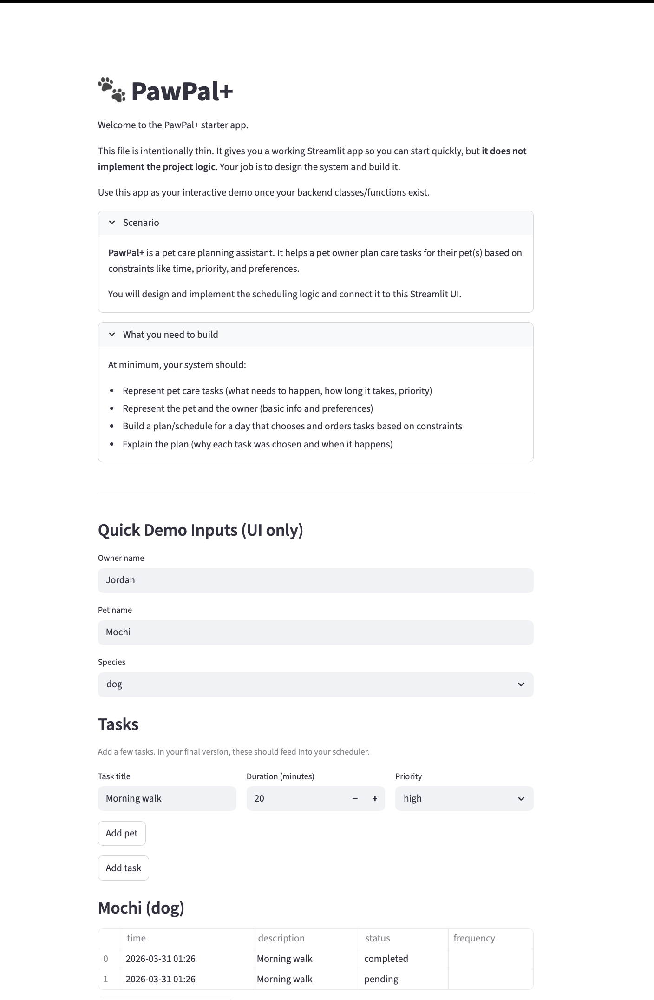

# PawPal+ (Module 2 Project)

You are building **PawPal+**, a Streamlit app that helps a pet owner plan care tasks for their pet.

## Scenario

A busy pet owner needs help staying consistent with pet care. They want an assistant that can:

- Track pet care tasks (walks, feeding, meds, enrichment, grooming, etc.)
- Consider constraints (time available, priority, owner preferences)
- Produce a daily plan and explain why it chose that plan

Your job is to design the system first (UML), then implement the logic in Python, then connect it to the Streamlit UI.

## What you will build

Your final app should:

- Let a user enter basic owner + pet info
- Let a user add/edit tasks (duration + priority at minimum)
- Generate a daily schedule/plan based on constraints and priorities
- Display the plan clearly (and ideally explain the reasoning)
- Include tests for the most important scheduling behaviors

## Smarter Scheduling

This project includes a small set of scheduling improvements implemented in the logic layer (`pawpal_system.py`):

- Sorting and filtering: tasks can be sorted by scheduled time and filtered by pet or status.
- Recurring tasks: tasks with `frequency='daily'` or `frequency='weekly'` automatically generate the next occurrence when marked complete.
- Conflict detection: a lightweight detector scans for exact timestamp conflicts across a user's pets and returns warnings instead of failing.

These features are intentionally simple and designed to be clear and easy to extend in future iterations.

## Features

Implemented features in this repository (what the app currently does):

- Sorting by time: tasks are ordered chronologically using Scheduler.sort_by_time.
- Filtering: tasks can be filtered by pet name and/or status using Scheduler.filter_tasks.
- Recurring tasks: tasks with `frequency='daily'` or `frequency='weekly'` automatically generate the next occurrence when marked complete (Scheduler.mark_task_complete).
- Conflict warnings: Scheduler.detect_conflicts scans for exact timestamp collisions across pets and returns warnings shown in the UI.
- UI integration: Streamlit `app.py` stores the Owner in `st.session_state`, displays sorted task tables, surfaces conflict warnings with `st.warning`, and provides per-task "Mark complete" buttons that trigger recurrence.
- Tests: an automated pytest suite (see `tests/test_pawpal.py`) verifies sorting, recurrence, and conflict detection behavior.

## Testing PawPal+

Run the automated test suite with:

```bash
python -m pytest
```

The tests included cover:

- Basic Task and Pet behavior (adding tasks, marking complete)
- Sorting correctness (tasks returned in chronological order)
- Recurrence logic (marking a daily task complete creates a new task for the next day)
- Conflict detection (identifies exact-time scheduling conflicts across pets)

Confidence level: ★★★★☆ (4/5)

Reason: The current tests cover core behaviors and the lightweight scheduler algorithms (sorting, recurrence, exact-time conflicts). More edge cases—like overlapping-duration conflicts, timezone handling, and persistence—should be tested in future iterations to increase confidence to 5 stars.

## Getting started

### Setup

```bash
python -m venv .venv
source .venv/bin/activate  # Windows: .venv\Scripts\activate
pip install -r requirements.txt
```

### Suggested workflow

1. Read the scenario carefully and identify requirements and edge cases.
2. Draft a UML diagram (classes, attributes, methods, relationships).
3. Convert UML into Python class stubs (no logic yet).
4. Implement scheduling logic in small increments.
5. Add tests to verify key behaviors.
6. Connect your logic to the Streamlit UI in `app.py`.
7. Refine UML so it matches what you actually built.

## 📸 Demo

Run the Streamlit app locally and take a screenshot to show the final UI.

1. Start the app:

```bash
streamlit run app.py
```

2. Open the app in your browser (Streamlit prints the local URL).
3. Take a screenshot of the main UI and save it to `

Then include the screenshot here by replacing the placeholder below (or I can add it for you if you upload the image):
<a href="/course_images/ai110/streamlit.png" target="_blank"></a>


